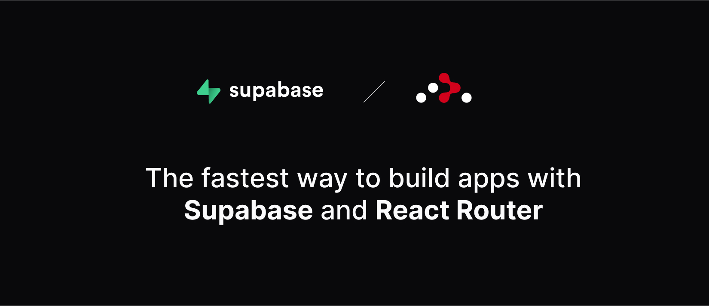

<h1 align="center">React Router and Supabase Starter Kit</h1>

<p align="center">
 The fastest way to build apps with React Router and Supabase. Remix and React Router were [merged together](https://remix.run/blog/incremental-path-to-react-19) and React Router v7 is now the recommended starting point.
</p>

<p align="center">
  <a href="#features"><strong>Features</strong></a> ·
  <a href="#clone-and-run-locally"><strong>Clone and run locally</strong></a>
</p>
<br/>

## Features

- Works across the entire [React Router](https://reactrouter.com/) stack, using the framework installation:
  - Vite server
  - Loaders
  - Actions
  - Auth
  - Client
  - Server
  - It just works!
- supabase-ssr. A package to configure Supabase Auth to use cookies
- Styling with [Tailwind CSS](https://tailwindcss.com)
- Components with [shadcn/ui](https://ui.shadcn.com/)

## Clone and run locally

1. You'll first need a Supabase project which can be made [via the Supabase Dashboard](https://database.new)

2. Create a React Router app using the Supabase Starter template npx command

   ```bash
    npx create-react-router@latest --template https://github.com/saltcod/rr-v7
   ```

3. Use `cd` to change into the app's directory

   ```bash
   cd name-of-new-app
   ```

4. Rename `.env.example` to `.env.local` and update the following:

   ```
   SUPABASE_URL=[INSERT SUPABASE PROJECT URL]
   SUPABASE_ANON_KEY=[INSERT SUPABASE PROJECT API ANON KEY]
   ```

   Both `SUPABASE_URL` and `SUPABASE_ANON_KEY` can be found in [your Supabase project's API settings](https://app.supabase.com/project/_/settings/api)

5. You can now run the React Router local development server:

   ```bash
   npm run dev
   ```

   The starter kit should now be running on [localhost:5173](http://localhost:5173/).

6. This template comes with the default shadcn/ui style initialized. If you instead want other ui.shadcn styles, delete `components.json` and [re-install shadcn/ui](https://ui.shadcn.com/docs/installation/next)

> Check out [the docs for Local Development](https://supabase.com/docs/guides/getting-started/local-development) to also run Supabase locally.

## Feedback and issues

Please file feedback and issues over on the [Supabase GitHub org](https://github.com/supabase/supabase/issues/new/choose)
